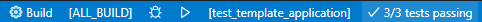

# Linux / Windows / Raspberry Pi Pico compatible application
This is a template project which can run on Linux, Windows and Raspberry Pi Pico. 
## Description


A CMake file template and sample C++ application which allows unit test by GoogleTest. This template application is :
- Able to collaborate with [Visual Studio CODE](https://azure.microsoft.com/ja-jp/products/visual-studio-code/) editor.
- Build in [GoogleTest](https://github.com/google/googletest) which is downloaded automatically.
- "src" directory for application source code.
- "test" directory for unit tests. 
- std::thread aware. 
- Generate Gcov data files during test ( except Windows platform )
- Tested: 
    - Ubuntu 24.04  with GCC.
- Automatically tested by GitHub Actions.
    - Ubuntu Latest with GCC.
    - Ubuntu Latest with Clang.
    - Windows Latest with MSVC 32bit.
    - Windows Latest with MSVC 64bit.
- Make coverage report and publish it to [Coveralls](https://coveralls.io/github/suikan4github/linux-windows-raspipico). 

## Requirement
### Ubuntu
- Ubuntu 24.04
- VS Code
- CMake 3.15 or newer
- g++
- gcc-arm-eabi-none, libnewlib-arm-none-eabi 

### Windows
- Windows 10 or 11
- VS Code
- CMake 3.15 or newer
- Microsoft Visual C++ compiler 

### WSL2
- Windows 10 or 11
- VS Code with [Remote Development extension pack](https://marketplace.visualstudio.com/items?itemName=ms-vscode-remote.vscode-remote-extensionpack)
- CMake 3.15 or newer
- g++
- ca-certificates


## Usage
### Visual Studio CODE
Run the followings command inside this directory ( Where README.md exists) to start the VS CODE: 
```Shell
code .
```
Inside VS CODE, Type Ctrl-Shift-P to show the command pallet. And then, execute following command :
```
CMake: Configure
```
Now, you can build, run the executable and Ctest from the status bar of the VS CODE.


### Command line
Run the followings commands inside this directory ( Where README.md exists) to build the Linux program: 
```sh
mkdir build
cmake -B build -S . -DCMAKE_C_COMPILER=gcc -DCMAKE_CXX_COMPILER=g++
cmake --build .
```
The executables are stored in the subdirectories: 
- build/src
- build/test

To run the Ctest, type :
```Shell
ctest --test-dir build
```

To build the Raspberry Pi executable, run the following commands : 

```sh
mkdir build
cmake -B build -S . -DCMAKE_C_COMPILER:FILEPATH=/usr/bin/arm-none-eabi-gcc \
-DCMAKE_CXX_COMPILER:FILEPATH=/usr/bin/arm-none-eabi-g++
cmake --build .
```
## Switching the target
To switch the target, make sure to remove the build directory. 

And then, execute the configuration from the command line. Or, on the VS Code, use CMake Extension to change the compiler. By changing compile, the CMake configure the appropriate target whichever it is Unix, Windows or bare metal. 

## Install
 
### Ubuntu
Run followings on the shell to install the essential tools. 
```Shell
apt-get -y update
apt-get -y install build-essential cmake ninja-build git 
apt-get -y install gcc-arm-none-eabi libnewlib-arm-none-eabi
apt-get -y install doxygen graphviz
```

## License
This project is shared with the [MIT License](LICENSE). 